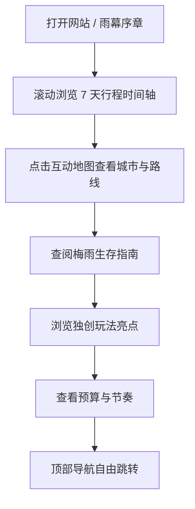

## 1. 产品概述

「梅雨之间・关西七日漫游」是一个交互式单页行程规划网站，为 2026 年 6 月 14 日—6 月 21 日的日本关西（大阪·奈良·宇治·京都·神户）梅雨季之旅量身定制。
- 解决问题：把一份独创、好玩、可落地的 7 天行程，变成一个可视化、可交互、随时翻看的旅行伴侣，而非死板的文字清单。
- 目标用户：本次旅行的出行者本人（中文使用者），以及同行伙伴；强调梅雨季"雨天友好"与独创性玩法。

## 2. 核心功能

### 2.1 功能模块

1. **首页 / 序章 (Hero)**：全屏雨幕氛围动画、旅行主标题、日期 6.14–6.21、向下滚动指引、关键数据（7 天 / 5 城 / 雨季限定）。
2. **行程时间轴 (Itinerary)**：7 天逐日卡片，每天含主题、城市、上午/下午/夜晚分段、独创玩法标签、雨天 Plan B。
3. **互动地图 (Map)**：关西五城的概念地图，点击城市高亮当天行程与连线路径。
4. **梅雨生存指南 (Tips)**：天气数据（关西梅雨 6/6–7/19，22–28℃，降雨 40–60%）、打包清单、雨天省钱小技巧、实用 App。
5. **独创玩法档案 (Highlights)**：精选 6 个"非大众"亮点（绣球花寺、雾中鞍马贵船、teamLab、宇治抹茶、神户夜景、硬币变戒指体验等），卡片式展示。
6. **预算与节奏 (Budget)**：每日花费概览、交通票券建议（关西周游券/ICOCA）、节奏强度可视化。
7. **页脚 (Footer)**：行程一句话总结、生成信息、返回顶部。

### 2.2 页面详情

| 页面 | 模块 | 功能描述 |
|------|------|----------|
| 单页应用 | Hero 序章 | 雨滴 canvas/CSS 动画、标题渐入、日期徽章、滚动指引箭头脉冲 |
| 单页应用 | 行程时间轴 | 7 张日卡，左右交错布局，滚动触发淡入；每卡显示城市、主题、时段分项、独创标签、雨天 Plan B 折叠 |
| 单页应用 | 互动地图 | SVG 关西概念地图，城市节点可点击；点击后右侧显示该城当天精华，路径线条按天动画绘制 |
| 单页应用 | 梅雨指南 | 天气信息卡、图标化打包清单、konbini 雨伞小技巧、Yahoo天气等 App 推荐 |
| 单页应用 | 独创亮点 | 6 张图文卡，hover 翻转/放大，含一句"为什么独特"说明 |
| 单页应用 | 预算节奏 | 每日预算条形可视化、票券建议、总预算估算（日元+人民币参考） |
| 单页应用 | 导航 | 固定顶部导航，锚点平滑滚动，当前 section 高亮 |

## 3. 核心流程

用户打开网站 → 被雨幕序章吸引 → 向下滚动浏览 7 天时间轴 → 点击互动地图查看城市路线 → 查阅梅雨生存指南与独创亮点 → 查看预算节奏 → 通过顶部导航在各板块间跳转。

## 4. 用户界面设计

### 4.1 设计风格
- 主色：墨蓝雨夜 `#1a2b3c` + 雨雾青灰 `#4a6b7c`；辅助色：抹茶绿 `#7a8c5a`、绣球花蓝紫 `#6c7bb5`、暖灯橙 `#e0a060`。
- 风格：日式"侘寂 + 梅雨"氛围，半透明玻璃拟态卡片、细雨纹理背景、留白克制、墨水晕染装饰。
- 按钮：圆角 + 细描边，hover 时柔光晕染。
- 字体：标题用有个性的衬线/书法感字体（如 "Shippori Mincho" / "Zen Old Mincho"），正文用清晰黑体（如 "Zen Kaku Gothic New" / "Noto Sans JP"）；中文标题搭配思源宋体气质。
- 图标/emoji：克制使用，雨滴☔、绣球花、抹茶、鹿等点缀。

### 4.2 页面设计概览
| 页面 | 模块 | UI 元素 |
|------|------|---------|
| 单页 | Hero | 深色雨夜渐变背景 + canvas 雨滴动画 + 大号衬线标题渐入 + 日期玻璃徽章 |
| 单页 | 时间轴 | 交错卡片、垂直墨线主轴、城市色彩标签、滚动 stagger 淡入 |
| 单页 | 地图 | SVG 关西轮廓、发光城市节点、点击高亮、路径描边动画 |
| 单页 | 指南/亮点 | 玻璃卡网格、hover 微浮起、绣球花配色点缀 |
| 单页 | 预算 | 渐变进度条、数字滚动计数动画 |

### 4.3 响应式
桌面优先，移动端自适应：时间轴在窄屏转为单列，地图可缩放，导航转为汉堡菜单，触摸友好。

