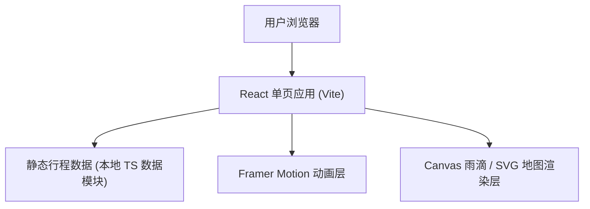

## 1. 架构设计



本项目为纯前端静态单页应用，无后端、无数据库。所有行程数据以本地 TypeScript 数据模块形式内置，便于维护与渲染。

## 2. 技术说明
- 前端框架：React@18 + TypeScript + Vite
- 样式方案：Tailwind CSS@3 + 少量自定义 CSS（雨滴/纹理/玻璃拟态）
- 动画库：Framer Motion（滚动触发、stagger、页面入场）
- 初始化工具：Vite (react-ts 模板)
- 字体：Google Fonts（Shippori Mincho / Zen Kaku Gothic New / Noto Sans JP）
- 图标：lucide-react
- 后端：无
- 数据库：无（行程数据为本地静态数据）
- 图片：通过文生图 API 按需生成关西氛围图

## 3. 路由定义
单页应用，使用锚点滚动而非多路由。

| 锚点 | 用途 |
|------|------|
| #hero | 序章雨幕首屏 |
| #itinerary | 7 天行程时间轴 |
| #map | 关西互动地图 |
| #tips | 梅雨生存指南 |
| #highlights | 独创玩法亮点 |
| #budget | 预算与节奏 |

## 4. 数据模型（本地静态数据）

```typescript
interface DayPlan {
  day: number;            // 第几天
  date: string;           // "6.14"
  weekday: string;        // "周日"
  city: string;           // 主要城市
  cityColor: string;      // 主题色
  theme: string;          // 当天主题
  morning: string;        // 上午安排
  afternoon: string;      // 下午安排
  evening: string;        // 夜晚安排
  unique: string;         // 独创玩法标签
  rainPlanB: string;      // 雨天备选
  budget: number;         // 当日预算(日元)
}

interface Highlight {
  title: string;
  desc: string;
  whyUnique: string;
  imagePrompt: string;
}

interface CityNode {
  name: string;
  x: number; y: number;   // SVG 坐标
  days: number[];         // 涉及的天数
  color: string;
}
```

## 5. 项目结构

```
src/
  components/
    Hero.tsx
    Navbar.tsx
    Itinerary.tsx
    KansaiMap.tsx
    Tips.tsx
    Highlights.tsx
    Budget.tsx
    Footer.tsx
    RainCanvas.tsx
  data/
    trip.ts        // DayPlan / Highlight / CityNode 数据
  App.tsx
  main.tsx
  index.css
```
